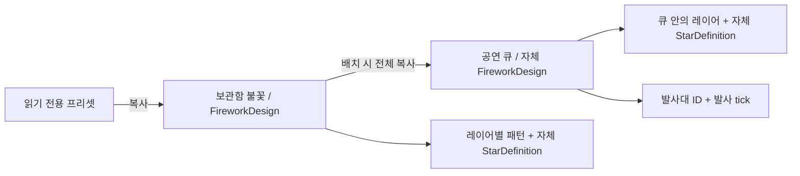

# CSR 편집기 구조와 상태의 소유권

2026-09-06. 현재 v2 구현 기준이다. 이전 Rust/R3F 제안은 [별도 원문](archive/project-structure-proposal.ko.md)에 보관한다.

## 구조

```text
src/
├── app/             화면 조립, StudioSession, 자동 저장·복구, JSON 입출력 경계, 렌더 진단
├── domain/          v2 스키마, v1 마이그레이션, 프리셋, 궤적·시간 계산
├── state/           문서 명령, 이력, 선택, 앱 내부 클립보드, 알림
├── i18n/            ko/en 사전, 타입, 언어 환경설정
├── runtime/         PlaybackClock, ParticleEngine, SimulationEngine 계약
├── viewport/        Three.js 자원과 GPU 버퍼, 카메라
├── features/
│   ├── header/      화면/언어 전환, 공연 이름, JSON, undo/redo
│   ├── library/     독립 불꽃 목록, 읽기 전용 프리셋
│   ├── designer/    개별 불꽃/큐의 레이어·패턴·발사 편집
│   ├── inspector/   편집 화면 선택, 레이어 발광체 편집
│   ├── show/        큐/발사대 설정, 추가·순차 배치 대화상자, 드래그 계약
│   ├── timeline/    겹침 배치, 드롭, 재생, 시간 표시
│   ├── viewport/    유지되는 CanvasHost와 독립 UI 자식
│   └── shared/      필드, 툴팁·대화상자, 패턴 아이콘
├── storage/         IndexedDB 보관함, 자산 검증, 이식 보관 형식
└── styles/          디자인 토큰, 두 편집 화면, 반응형 구성
```

`domain`과 `runtime`은 React·Zustand·Three.js를 참조하지 않는다. 엔진에 DOM이나 GPU 객체를 전달하지 않는다. ESLint가 의존성 경계를 검사한다.

## 복사 경계와 JSON 원본



`StarDefinition`은 레이어에 내장한 발광체 외형 설정이다. `LayerDefinition`은 패턴·개수·확장·회전·지연·초기 속도·감속·시드와 자체 발광체를 가진다. `FireworkDesign`은 발사 높이/상승 시간과 레이어 목록이다. 보관함 항목과 큐가 각각 독립된 `FireworkDesign`을 소유한다.

프리셋 적용, 불꽃 복제, 큐 배치, 큐 복사 시 설정을 깊이 복사한다. 원본/복사본 간의 공유 ID 참조가 없다. 레이어 ID는 각 불꽃 안에서만 유일하면 되며 시드는 복사 시 유지하므로 복제 자체가 모양을 무작위로 바꾸지 않는다. 사용자의 큐 이름도 복사 후 독립적이다.

```text
ShowDocument
  formatVersion = star-studio/2
  modelVersion = visual-star/2
  tickRate = 120
  name
  fireworks[id] = { id, name, design: { flight, layers[] } }
  launchers[id] = { id, name, x, z }
  cues[id] = { id, name, launcherId, atTick, design: { flight, layers[] } }
```

입력 스키마의 SoT는 `domain/schema.ts`, 범위와 기본 시각 계수의 SoT는 `domain/catalog.ts`다. 타입은 Zod에서 추론한다. 결과 입자, 프레임 이력, 재생 위치, 카메라, 언어, UI 선택은 이 문서에 넣지 않는다.

`domain/shapes.ts`는 하트·고양이·사과·컵의 정규화된 윤곽을 소유한다. 윤곽의 길이를 따라 발광체를 균등 샘플링하며 아이콘도 같은 경로를 사용한다. 각 점의 중심으로부터의 거리를 속도에 유지하므로 도형 전체가 확대된다. 방향을 단위 벡터로 정규화하지 않는다. 모든 점에 같은 확장·중력·저항을 적용하고 수명 편차를 작게 제한하여 실루엣이 유지된다. 점이 적으면 미세한 윤곽은 생략되며, 현재 패턴은 정면 감상을 전제로 하는 평면이다.

이미지 기반 개인 불꽃은 일반 `artwork` 패턴과 `assetId` 참조로 저장한다. 그림 격자는 브라우저의 개인 자산 보관함에 내용 해시별로 한 번만 저장되고, 각 레이어는 2D·3D 배치와 외곽·채움·디테일·외피 부분만 참조한다. 배포 코드에는 개인 그림이나 이름을 넣지 않는다. 보관함과 이식 가능한 내보내기 형식은 [개인 보관함과 프로젝트 저장](personal-storage.ko.md)을 따른다.

`domain/festival.ts`는 20개 발사대·175개 큐·11종 보관함 불꽃을 생성하는 공연 템플릿이다. 매 호출 새 문서를 만들고, 보관함 설계를 각 큐에 깊이 복사한 뒤 높이·색·시드 등을 큐 안에서만 변경한다. 생성한 문서는 저장 스키마로 검증한다. 마지막 대형 불꽃의 전체 수명을 계산하여 종료가 60초가 되도록 발사 tick을 정한다. `examples/midnight-fantasy.fireworks.json`은 이 생성기의 저장 결과다.


## 실행 경계

| 소유자 | 유일한 원본 |
| --- | --- |
| documentStore | 저장 문서, undo/redo |
| editorStore | designer/show 화면, 감상 모드, 현재 선택, 편집 대상, 선택 레이어, 상세 탭, 클립보드 |
| localeStore | 언어 환경설정 |
| PlaybackClock | tick, duration, playing, loop |
| ParticleEngine | 궤적 캐시, 프레임용 typed array |
| ThreeViewport | 카메라, WebGL 장면/자원 |

`App`은 페이지 종류와 감상 모드만 구독한다. `CanvasHost`는 memo로 보호하고 두 페이지와 감상 화면에서 동일한 React 위치에 유지한다. 캔버스의 UI 자식들은 언어·보기 종류·오류·공연 제목과 개수만 필요에 따라 구독한다. 감상 모드는 엔진을 다시 로드하지 않고, 타임라인의 구독을 해제하며, 같은 시계에 연결된 작은 재생 컨트롤을 표시한다. `StudioSession`은 문서/편집기/시계를 엔진과 연결하며 언어 변경은 캔버스 접근성 설명에만 전달한다.

문서 수정은 바뀐 엔티티와 레이어만 새 참조로 만든다. 전체 문서 파싱은 파일 가져오기/초기 로드에만 수행한다. 일반 숫자·이름은 입력 요소 안에서 임시 편집 후 blur/Enter에 확정한다. 범위 조절은 실시간 반영하되 한 번의 드래그를 하나의 undo 항목으로 묶는다. 이력은 구조를 공유하는 최대 80개 문서다.

목록은 ID 배열, 행은 자기 불꽃, 편집 필드는 현재 항목만 구독한다. 배열 선택자는 useShallow를 쓴다. 프레임마다 갱신하는 전역 React Context를 사용하지 않는다. 시간 출력은 재생 중 10Hz, 탐색 막대는 20Hz, 일시정지 시에는 정확한 tick이다. 타임라인 재생 헤드는 시계 알림으로 위치만 갱신한다.

네이티브 드래그 데이터는 `application/x-star-studio`에 종류/ID/잡은 위치를 저장한다. 드래그 중 문서는 바꾸지 않으며 드롭 때만 발사대·시간을 한 번에 확정한다. 0.1초 스냅과 최대 발사 시각을 같은 함수에서 처리한다. 겹치는 큐는 시작/끝 구간으로 행을 나누고 발사대 이름을 고정한다. 순차 배치는 불꽃 선택 순서와 발사대 X 좌표 순서를 순환하며 전체 큐를 하나의 명령으로 만든다.

## 폭발, 높이, 탐색

- `atTick / 120`: 발사 시각.
- `riseSeconds`: 발사부터 중심 폭발까지의 시간.
- `height`: 중심 폭발의 가상 높이. 실제 사거리/약제량 모델이 아니다.
- `delaySeconds`: 중심 폭발 이후 해당 레이어가 시작될 때까지의 시간.
- `burstStrength`: 폭발 순간의 추가 속도 배율.
- `burstSeconds`: 그 추가 속도가 지수적으로 사라지는 시간 규모.
- `dragScale`: 이후 확장의 감속 배율.

레이어 궤적은 상대 원점에서 컴파일하고 높이/발사대 위치를 렌더 시 더한다. 발사 시각, 높이, 상승 시간이나 발사대만 바꾸면 패턴별 궤적을 다시 생성하지 않는다. 레이어 객체를 키로 하는 WeakMap 캐시를 쓴다. 시드는 레이어와 논리 발광체 인덱스에서 유도하며 `Math.random()`과 프레임 방문 순서를 사용하지 않는다.

위치의 기본 이동 거리는 `k = (1 - exp(-drag × age)) / drag`이며 여기에 `(burstStrength - 1) × burstSeconds × (1 - exp(-age / burstSeconds))`를 더한다. 따라서 초기 도함수는 크고 추가 속도는 빠르게 줄어든다. 중력은 기본 저항 모델로 적용한다. 중심 섬광은 짧게 사라지고, 발광체는 수명 후반에 감광하며 잔광은 고정 시각 샘플로 재구성한다. 이것은 의도한 연출을 위한 분석식이지 검증된 연소/폭발 모델이 아니다.

특정 시각을 바로 평가하므로 되감기에 프레임 캐시가 필요 없다. 카메라만 움직이면 계산된 프레임을 다시 그린다. 정지 중 변화가 없으면 RAF도 멈춘다. 탭이 숨겨지면 재생을 일시정지한다. GPU 버퍼를 재사용하며 표시 범위만 업데이트한다.

같은 모델·입력·시드·시각의 재현을 목표로 한다. 엔진 버전이나 다른 브라우저 사이의 비트 동일성은 보장하지 않는다. 바람/유체/충돌처럼 이력에 의존하는 모델이 추가되면 탐색 전략을 다시 설계해야 한다.

## 호환성과 한계

v1 JSON은 공유 효과별로 보관함 불꽃을 만들고 큐별로 독립 설계를 복사한다. 기존 이름·배치·시각·외형을 가져오며 큐/효과의 시드에서 새 로컬 시드를 유도한다. 높이/상승 시간과 새 폭발 계수는 기본값을 채운다. `visual-star/2`는 새 모션 모델이므로 v1과 동일한 화면 재생을 약속하지 않는다.

프로젝트는 IndexedDB에 revision 기반 비교·교환으로 저장한다. 각 탭은 저장 전에 해당 탭 전용 동기 복구 저널을 쓰며, 비동기 저장이 성공해도 일치하는 프로젝트 ID·토큰의 저널만 지운다. 다른 탭의 더 새 저장본이나 보관 처리와 충돌하면 원본을 보존하고 복구 내용은 별도 사본으로 저장한다. 가져오기 실패 시 현재 문서는 바뀌지 않는다. 불꽃·공연 파일 상한은 5MiB, 전체 보관함 백업은 64MiB다. 최대 불꽃 64개/레이어 8개/발사대 32개/큐 256개/발사 시작 120초다. 렌더 버퍼는 131,072점, 좌표/색/크기/밝기 합계 4MiB다. 상한에 닿으면 후속 표시를 생략하며 프레임 내 추가 샘플 순회도 중단한다. 캐시/GPU 메모리와 문서 이력은 별도이며 이 제한은 FPS 보장이 아니다.

현재는 TypeScript 엔진이며 Rust/Wasm·Worker를 구현하지 않았다. `SimulationEngine.load(document, target)` / `evaluate(tick)`가 교체 지점이다. Wasm 메모리 증가, 버퍼 소유권/전달, Worker 동기화와 성능은 그 단계에서 검증한다.
