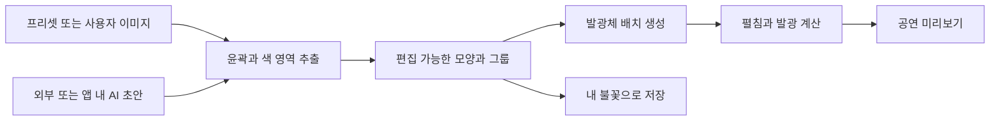

# 개인 불꽃 제작 방향: AI 이미지, 편집 가능한 배치, 확장 제어

검토일: 2026-09-06. 현재 소스, [앞선 최소단위 조사 검토](/Users/carlos-yang/dev/fireworks-simulator/research/external-research/review.ko.md), 형상 제어 논문, 이미지 벡터화 연구와 도구의 공식 문서를 종합했다. **이 문서는 제품 방향과 후속 설계 제안이다. 앱 동작이나 저장 형식은 변경하지 않았다.**

## 1. 추천 방향

**대중적인 제품으로는 ‘이미지나 AI 초안에서 시작해 내 불꽃을 완성하는 편집기’를 추천한다.** 기본 배치는 자동으로 만들고, 사용자는 윤곽·부분별 색·밀도·펼침·잔광을 조절한다. 엔진은 그 아래에서 개별 발광체의 움직임을 계산한다.

사용자의 두 의견은 함께 성립한다. 사람이 수많은 점을 직접 찍을 필요는 없지만, 자동으로 만든 결과의 모양을 수정할 수는 있어야 한다. 따라서 핵심 자산은 **편집 가능한 모양과 발광 설정**이다. 이미지와 AI는 이 자산을 만드는 입력 방법이다.

앞선 조사의 ‘발광체를 기본 개체로 삼자’는 결론을 ‘사용자가 발광체를 하나씩 수작업으로 배치해야 한다’로 연결할 필요는 없다. 다음 세 단위를 분리하는 편이 적절하다.

| 역할 | 기본 단위 | 사용자가 하는 일 |
|---|---|---|
| 제작·편집 | 모양, 윤곽선, 영역, 그룹 | 귀를 늘리고, 눈을 옮기고, 외곽을 촘촘하게 만들기 |
| 운동 계산 | 독립 궤적과 발광 수명을 가진 가상 발광체 | 필요할 때만 개별 보정 |
| 화면 표현 | 발광점, 꼬리, 불티, 선분 | 표현 품질과 시각적 성격 조정 |

그램은 질량 단위이고, 원료 알갱이와 발광체는 다른 대상이다. 기존 조사에서 모든 불꽃에 적용할 물질의 최소 입도나 질량 기준을 확정하지 못했다. 현재 제품의 상세도를 결정하는 데 필요한 것은 **어떤 윤곽과 특징을 관람 거리에서 유지할지**다. 실제 성분이나 내부 충전 상태를 입력받는 방식은 별도의 검증 모델을 요구하며, 현재 엔진이 제공하는 조형 자유도를 늘리는 선행 조건은 아니다.

시뮬레이터의 재미는 발사대·상승·개화·감속·낙하·잔광·공연 타이밍에서도 만들 수 있다. 기본 제작 화면은 ‘내 불꽃 만들기’, 상세 화면은 ‘모양·빛·움직임’으로 구성하는 안이 맞는다.

## 2. 현재 구현에서 확인한 점

### 초기 폭발 속도가 커지면 더 멀리 퍼지는 이유

현재 계산에서는 **초반 속도를 강조하는 항이 총 이동 거리도 늘린다.** 또한 ‘퍼짐 크기’도 목표 반경이 아니라 기본 속도에 곱하는 값이다. 두 조절기가 같은 결과에 영향을 주므로, 사용자가 원하는 크기와 터지는 인상을 맞추려면 현재는 함께 조정해야 한다.

| 현재 항목 | 실제 계산상의 역할 | 관람 결과 |
|---|---|---|
| 퍼짐 크기 `spread` | 패턴의 기본 속도에 곱함 | 전체 이동 거리 증가 |
| 초기 폭발 속도 `burstStrength` | 초반의 추가 속도 크기 | 처음 더 빠르고, 그동안 더 멀리 이동 |
| 폭발 시간 `burstSeconds` | 추가 속도가 줄어드는 시간 상수 | 길수록 추가 이동이 오래 누적됨. 섬광 시간에도 연결됨 |
| 감속 `dragScale` | 기본 운동의 저항 배율 | 속도가 줄어드는 정도 변화 |
| 발광체의 수명·크기·프로필 | 수명과 저항 등에 관여 | 얼마나 멀리 이동한 상태까지 보이는지에도 영향 |

‘같은 시간 동안 더 빨리 이동하므로 범위가 커진다’는 관찰은 맞다. 다만 **정해진 시간이 되면 확장을 멈추는 구현은 아니다.** 추가 속도가 지수적으로 감소하며, 그 이후에도 기본 운동과 낙하는 계속된다. 현재 ‘폭발 시간’은 확장 종료 시각과 같지 않다.

근거: [운동 계산](/Users/carlos-yang/dev/fireworks-simulator/src/domain/patterns.ts:18), [퍼짐 크기를 속도에 적용하는 부분](/Users/carlos-yang/dev/fireworks-simulator/src/domain/patterns.ts:71), [섬광 지속시간](/Users/carlos-yang/dev/fireworks-simulator/src/domain/patterns.ts:98). 수식과 수치 예시는 부록 A에 분리했다.

### 모양 편집은 아직 구현되지 않았다

현재는 고정 윤곽을 샘플링하거나, 내장 캐릭터 그림에서 색과 위치를 추출해 발광체를 만든다. 캐릭터 경로는 이미 윤곽·채움·디테일을 구분하고, 색 영역에 따라 표본을 배분한다. 따라서 이미지에서 배치를 얻는 방향과 연결할 기반은 있다. [고정 윤곽 데이터](/Users/carlos-yang/dev/fireworks-simulator/src/domain/shapes.ts:18), [캐릭터 분해](/Users/carlos-yang/dev/fireworks-simulator/src/domain/characters.ts:17), [배치 생성](/Users/carlos-yang/dev/fireworks-simulator/src/domain/characters.ts:74)

그러나 저장 문서의 레이어는 등록된 `pattern`과 설정값을 선택한다. 사용자 이미지, 편집 가능한 경로, 영역별 수정, 개별 위치 수정은 저장 계약에 없다. 즉 **그림을 불꽃으로 표현하는 기반과 사용자가 그림을 고치는 편집기는 별개이며, 후자가 빠져 있다.** 앞선 조사에서 제안한 편집 가능한 분포까지 프로토타입이 구현한 것은 아니다. [현재 레이어 스키마](/Users/carlos-yang/dev/fireworks-simulator/src/domain/schema.ts:13)

또한 현재 모양 좌표는 발광체의 초기 위치가 아니라 **속도 벡터를 만드는 좌표**다. 부모 발광체의 시작점은 모두 중심이다. 화면에 가상 용기를 그려 점을 넣는 기능만 추가해서는 이 의미가 해결되지 않는다. [초기 위치와 속도](/Users/carlos-yang/dev/fireworks-simulator/src/domain/patterns.ts:74)

## 3. 논문과 도구가 뒷받침하는 범위

아래는 문헌에서 확인한 내용이다. 이를 이 앱의 UX와 데이터 구조에 적용하는 이후 절은 설계적 판단이며, 해당 논문이 이 제품을 검증했다는 의미는 아니다.

| 자료 | 확인한 내용 | 이번 판단에 주는 근거와 한계 |
|---|---|---|
| Zhao 등, *Fireworks controller*, 2009 | 목표 3D 메시에서 표본을 얻고 역동역학으로 형상을 제어하는 불꽃 애니메이션. 출판사 초록 확인 | 사용자가 모든 속도를 직접 입력하지 않고 목표 형상으로 운동을 만드는 선례. 실제 내부 충전 구조를 예측하는 검증은 아님. [출판사](https://onlinelibrary.wiley.com/doi/10.1002/cav.287) |
| Cui 등, *Sketch-based shape-constrained fireworks simulation in head-mounted virtual reality*, 2020 | 스케치로 데이터베이스의 3D 모델을 찾고, 특징을 고려한 표본화와 목표 위치를 이용해 애니메이션 생성. 저자 PDF의 관련 본문·표·그림 설명 확인 | 스케치를 받아 임의의 새 3D 형상을 생성하는 연구로 확대 해석하면 안 됨. 복잡한 메시의 실험 표본 수는 실제 발광체의 최소 수나 브라우저 성능 기준이 아님. [저자 공개본](https://graphics.cs.uh.edu/wp-content/papers/2020/2020-CAVW-SketchFireworkSimulation.pdf) |
| FWsim 공식 효과 편집기 문서 | 별의 분포와 속도·외관을 구분해 조정. 폭발 강도는 방출 속도와 확산 범위에 영향 | 현재 속도와 범위가 연결되는 모델에도 도구상의 선례는 있음. 이 앱에서 더 쉬운 크기 제어를 제공할지는 별도의 UX 선택. [공식 문서](https://www.fwsim.com/doc/en/effecteditor.html) |
| FWsim 공식 변경 기록, 2020-06-07 | 사용자 그림을 문양 불꽃으로 쓰는 Custom Shape 기능 기록 | 이미지·그림 입력의 제품 선례. 당시 변경 기록을 확인한 것이며 현재 UI의 동일한 조작 절차까지 검증한 것은 아님. [공식 기록](https://www.fwsim.com/updates-v3.php) |
| Ma 등, *Towards Layer-Wise Image Vectorization*, CVPR 2022, LIVE | 래스터 이미지를 레이어 구조를 가진 SVG로 변환하고 후속 편집 가능성을 다룸 | ‘비슷한 이미지로 변환’뿐 아니라 ‘수정하기 좋은 구조’가 중요한 연구 문제. 이 앱의 변환기나 자동 부위 인식 정확도를 검증한 것은 아님. [학회 초록](https://openaccess.thecvf.com/content/CVPR2022/html/Ma_Towards_Layer-Wise_Image_Vectorization_CVPR_2022_paper.html) |
| Rodriguez 등, *StarVector: Generating Scalable Vector Graphics Code from Images and Text*, CVPR 2025 | 이미지·텍스트에서 SVG 코드를 생성하며 경로 외의 도형 요소도 활용 | 장기적으로 AI가 편집 가능한 초안을 만드는 접근의 근거. 임의 사진을 완벽히 분해하거나 불꽃용 배치를 바로 생성한다는 보장은 없음. [학회 초록](https://openaccess.thecvf.com/content/CVPR2025/html/Rodriguez_StarVector_Generating_Scalable_Vector_Graphics_Code_from_Images_and_Text_CVPR_2025_paper.html) |

LIVE와 StarVector는 학회 공식 페이지의 검색 추출에서 서지와 초록을 확인했다. 해당 페이지의 직접 열람은 접근 제한으로 실패했으며, 전문·코드 실행·성능 재현은 수행하지 않았다. Cui 논문은 텍스트와 표·그림 설명을 확인했으며 그림의 시각적 재검증을 완료했다고 보지 않는다.

이 자료들을 종합하면 **목표 모양 → 표본 분포 → 운동**과 **이미지 → 편집 가능한 도형**을 연결하는 방향은 근거가 있다. 실제 물질 배치를 정밀하게 모델링해야만 개인 불꽃을 만들 수 있다는 결론은 나오지 않는다.

## 4. 제작 방식 비교와 선택

아래 평가는 이 프로젝트에 대한 제품 판단이다. 대중성이나 이탈률을 사용자 실험으로 측정한 결과는 아니다.

| 방식 | 장점 | 부담 | 추천 위치 |
|---|---|---|---|
| 실제 재료·내부 배치 중심 | 전문 시뮬레이터라는 인상이 강함 | 입력과 결과의 관계를 이해하기 어렵고, 현재 없는 실물 검증 모델 필요 | 현재 기본 제작 흐름에서 제외 |
| 사람이 점과 3D 방향을 전부 편집 | 개별 제어 가능 | 반복 작업이 많고 시작이 어려움 | 상세 보정용 선택 기능 |
| 외부 AI 이미지·사용자 그림 업로드 | 원하는 초안을 가져오기 쉽고 앱 내 AI 연결 없이 시작 가능 | 다른 도구와 오가는 과정, 변환 품질 확인 필요 | 첫 구현의 주 입력 경로 |
| 앱 안에서 AI로 초안 생성·부분 수정 | 한 화면에서 생성과 수정을 반복 가능 | 모델 연결, 응답 시간, 비용, 실패 처리 등 추가 설계 필요 | 같은 편집 구조 위에 후속 추가 |

**첫 구현은 ‘프리셋 또는 이미지로 시작 → 자동 배치 → 부분 수정’으로 권한다.** 장기적으로 앱 내 AI가 앞부분을 담당하게 해도 뒤의 편집기와 시뮬레이터는 그대로 사용할 수 있다.

다만 외부 AI 사용을 필수 조건으로 만들면 시작 과정이 길어진다. 샘플 이미지와 기존 프리셋만으로도 완성할 수 있게 하고, 템플릿과 AI용 요청문을 선택적으로 제공하는 편이 좋다. AI 결과를 다시 생성해야만 눈 위치 하나를 고칠 수 있는 구조는 피해야 한다.

## 5. 이미지 입력 양식은 무엇을 요구해야 하나

첫 입력 형식은 **정면에서 본 단순한 모양도**를 권한다. 불꽃이 터진 사진은 잔광·연기·배경·원근이 이미 섞여 있으므로, 원하는 발광체 배치를 지정하는 양식으로 쓰기 어렵다. 이 판단은 현재 엔진이 요구하는 좌표와 색 정보를 기준으로 한 것이다.

초기 양식은 두 가지면 시작할 수 있다.

| 양식 | 사용자가 준비할 그림 | 앱에서 얻을 정보 |
|---|---|---|
| 윤곽형 | 투명 배경, 선명한 선 또는 단순 실루엣 | 윤곽선과 안쪽 구멍, 윤곽을 따라 놓을 발광체 |
| 색 영역형 | 투명 배경, 구분되는 단색 면, 중요한 특징이 충분히 큰 그림 | 색별 영역과 경계, 영역별 발광 설정 |

정해진 픽셀마다 발광체 하나를 배치하도록 요구하지 않는다. 업로드 해상도와 발광체 수는 분리한다. 사용자는 ‘윤곽 강조’, ‘안쪽 채움’, ‘세부 유지’와 같은 선택으로 변환 결과를 조정할 수 있다.

AI용 요청문의 예시는 다음 정도다.

> 불꽃 모양의 원본으로 사용할 정면 고양이 아이콘을 만들어줘. 투명 배경, 구분되는 단색 영역, 선명한 외곽선으로 표현해줘. 눈과 귀는 작아져도 구분되게 해줘. 광채, 불티, 그림자, 연기와 배경은 넣지 말아줘.

양식 준수 여부를 AI가 항상 지킨다고 가정하지 않는다. 가져오기 화면에서 배경 제외, 자르기, 작은 잡점 제거, 색 수 단순화, 윤곽 미리보기를 제공하는 안이 필요하다. 사진도 이후 지원할 수 있지만, 첫 품질 기준은 단순 아이콘과 실루엣에 두는 편이 판단하기 쉽다.

SVG는 곡선과 도형을 보존할 수 있는 추가 입력 후보다. 다만 SVG라는 확장자만으로 의미 있는 레이어나 간단한 경로가 보장되지는 않는다. 실제 도입 시 지원할 도형·스타일 범위를 정하고 내부 배치 자료로 변환해야 한다. 초기 사용자에게 SVG 제작을 요구할 필요는 없다.

## 6. 자동 변환 이후에도 편집 가능한 구조



위 흐름은 제안이며 현재 구현된 입력 파이프라인은 아니다. 다음 네 단계의 책임을 구분한다.

1. **형태 추출:** 배경을 제외하고 외곽선, 내부 구멍, 색 영역을 얻는다. 색으로 나눈 그룹이 곧 ‘눈’이나 ‘귀’라고 가정하지 않는다. 의미별 이름 붙이기는 AI 보조 또는 사용자 선택으로 추가할 수 있다.
2. **편집 원본 생성:** 경로·영역·그룹을 만든다. 원본 이미지의 매 픽셀을 독립 편집 객체로 만들지 않는다.
3. **발광체 배치:** 윤곽 길이, 채울 면적, 특징의 중요도에 맞춰 표본을 배분한다. 작은 눈과 수염은 넓은 얼굴 면에 밀려 사라지지 않도록 우선순위를 줄 수 있다.
4. **운동과 발광 적용:** 같은 배치에 펼침, 색 전환, 꼬리, 낙하, 잔광을 적용한다. 모양 자료와 불꽃의 시간적 성격은 각각 조정할 수 있게 한다.

사용자에게 필요한 직접 편집은 다음 정도다.

- 부분 선택, 이동·회전·크기 조절, 복제·삭제.
- 윤곽을 밀거나 당기기, 지우개·브러시로 일부 보정, 좌우 대칭.
- 그룹별 색·밝기·밀도·꼬리·발광 시간 조정.
- 중요한 영역의 디테일 유지, 수정한 부분 잠금.
- 선택적으로 개별 발광체 위치 보정.

예를 들어 AI로 만든 고양이의 귀가 짧다면 귀 주변을 선택해 늘린다. 눈은 안쪽으로 옮기고, 눈 그룹의 밝기를 올린다. 외곽에는 금빛 꼬리를 적용한다. 방향 벡터 수백 개를 직접 입력할 필요가 없다.

**재생되는 결과는 실제로 발광체가 이동하며 만들어야 한다.** 원본 이미지를 평면에 붙여 확대하는 것만으로 끝내면 현재 사용자가 기대하는 펼침과 잔광 조절이 부족하다. 반대로 형상을 오래 고정하면 불꽃보다 정지된 빛 그림에 가까워질 수 있다. 짧은 섬광 → 빠른 펼침 → 모양이 읽히는 순간 → 감속·낙하·소멸을 분리해 미리보는 방향을 권한다.

## 7. 배치 좌표와 3D의 의미

같은 좌표라도 세 가지 의미가 있다.

| 좌표의 의미 | 입력하는 것 | 결과를 얻는 방식 |
|---|---|---|
| 목표 배치 | 펼쳐졌을 때 나타날 모양 | 엔진이 각 발광체의 운동을 유도 |
| 초기 배치 | 시작할 때 가상 공간 안에 놓인 위치 | 별도의 운동 규칙을 적용해 결과 계산 |
| 초기 속도 | 출발 방향과 속력 | 위치를 시간에 따라 계산 |

**기본 제작 화면의 좌표는 목표 배치로 권한다.** ‘귀를 위로 옮기면 펼쳐진 귀가 위로 간다’는 대응이 쉽기 때문이다. 목표 배치와 초기 속도를 동시에 독립적인 편집 원본으로 두지 않고, 선택한 운동 모델이 둘 사이의 변환을 책임져야 한다.

가상 구 안에 발광체를 담는 화면은 고급 배치 방식으로 만들 수 있다. 이 경우에도 점의 위치를 어떤 방향·속도로 바꿀지 정해야 한다. 실제 화약통의 내부 상태를 그대로 예측하는 모델로 해석해서는 안 되며, 기본 화면에 반드시 필요한 단계도 아니다.

이미지 한 장은 기본적으로 정면 정보를 준다. **두께를 주거나 부풀리는 변환은 입체감을 만드는 규칙이며, 원본의 보이지 않는 뒷면을 정확히 복원한 결과는 아니다.** 현재 캐릭터 코드도 실루엣과의 거리로 깊이를 만드는 규칙을 사용한다. 첫 버전은 평면 문양을 기본으로 하고, 입체감을 주는 옵션과 여러 각도 미리보기를 제공하는 편이 설명하기 쉽다.

문양의 방향은 공연 안에서 고정된 공간 방향으로 다룬다. 정면에서 읽히는 모양이 옆에서도 똑같이 보인다고 약속하지 않는다. 완전한 3D 형상 제작은 별도 모델 입력이나 추가 제작 기능이 필요한 후속 범위로 남긴다.

## 8. 모양 크기와 초반 속도를 사용자 관점에서 분리하기

이미지로 원하는 형상을 만들수록 ‘터지는 느낌을 바꾸었더니 크기도 달라진다’는 현재 문제는 더 크게 느껴질 수 있다. 기본 모양 제작에는 아래 구분을 권한다.

| 제안하는 조절 항목 | 사용자가 기대할 결과 |
|---|---|
| 모양 크기 | 펼침이 끝난 시점의 발광체 배치 크기 |
| 펼쳐지는 시간 | 위 크기에 도달하는 시간 |
| 초반 확장 강조 | 같은 크기·시간 안에서 초반에 얼마나 빠르게 벌어질지 |
| 잔광 시간 | 펼쳐진 뒤 빛이 남는 정도 |
| 흐트러짐·낙하 | 형상이 이후 얼마나 자연스럽게 변하는지 |

현재의 속도와 확산 범위가 연결된 계산은 자유 확산 효과에 활용할 수 있다. 다만 실제 초기 속도를 독립적으로 올리면서 이동 거리를 유지하려면 감속이나 운동 곡선도 함께 바꾸어야 한다. 이름만 바꿔 두 값이 독립인 것처럼 설명하면 안 된다.

형상 제어용 곡선의 예시는 부록 B에 제시했다. 이는 실제 물리식을 보정한 결과가 아니라 **지정한 크기와 시간을 지키도록 만든 시각적 제어 모델**이다. 개별 낙하나 흩어짐까지 포함한 모든 픽셀의 범위를 ‘최대 크기’라고 단정하지 않고, 무엇을 기준으로 잰 크기인지 정의해야 한다.

## 9. AI, 저장 자료와 단일 원본

### AI는 제작 시점에 사용한다

AI를 실행할 때마다 새로운 결과가 나올 수 있으므로 프롬프트만 저장해 재생 시 다시 생성하는 방식은 맞지 않는다. **사용자가 채택한 모양 자료를 저장한 뒤, 공연에서는 그 자료로 발광체와 시간별 결과를 계산한다.**

AI 생성이나 재변환은 새 초안으로 취급한다. 기존의 수동 수정은 잠그거나 별도 복사본에서 비교할 수 있게 한다. 나중에 앱 내 AI를 붙이더라도 입력은 이미지·요청·선택 영역이고, 출력은 현재 편집기에서 수정 가능한 초안이어야 한다. AI가 별도의 숨겨진 모양 원본을 소유하게 만들지 않는다.

### 원본 이미지와 편집 자료의 책임을 구별한다

- 원본 이미지와 프롬프트는 참고·재변환용 출처 자료로 보존할 수 있다.
- 사용자가 채택한 경로·영역·그룹과 수정 사항이 재생할 모양의 기준이다.
- 추출된 발광체 궤적과 GPU 배열은 파생 자료다.
- 원본 이미지를 다시 읽거나 외부 AI에 연결해야만 기존 공연을 재생할 수 있는 구조는 피한다.

저장할 형태의 후보는 경로 기반, 영역 기반, 직접 점 배치다. 한 자산 안에서 어떤 표현이 편집 원본인지 명확히 한다. 생성 규칙에서 직접 점 편집으로 전환한다면 그 이후 점 배치가 원본이 되고, 생성 규칙은 출처 기록으로 남길 수 있다. 둘을 동시에 자동 갱신하는 경쟁 원본으로 두지 않는다.

레이어·그룹에는 안정적인 ID를 부여한다. 경로 위 수정은 경로 ID와 경로상의 위치에 연결하거나, 명시적인 점 ID에 연결한다. 현재는 표본 수를 바꾸면 기본 배치 좌표가 바뀔 수 있다. **seed가 같다는 사실만으로 기존 눈 위치 수정이 보존되지는 않는다.** 소수의 점 수정을 강조하기 전에 경로와 그룹 수정부터 제공하면 이 문제도 줄일 수 있다.

### 프리셋과 큐는 항상 복사해서 사용한다

`프리셋 → 내 불꽃의 독립 복사본 → 큐에 배치한 독립 복사본` 원칙을 유지한다. 모양 자료, 부분별 발광 설정과 움직임 설정까지 이 소유권에 포함해야 한다. 현재 저장·배치 동작도 디자인을 복사하고 있다. [내 불꽃 저장](/Users/carlos-yang/dev/fireworks-simulator/src/state/documentStore.ts:98), [큐 배치](/Users/carlos-yang/dev/fireworks-simulator/src/state/documentStore.ts:127)

공연 JSON에는 큐의 시각·발사대와 해당 복사본의 입력 자료를 담는다. 각 프레임의 결과를 저장하지 않는다. 원본 이미지까지 함께 보관할 경우 그 용량은 별도 자산 비용으로 계산해야 하며, ‘JSON이므로 작다’고 볼 수는 없다. 내보낸 공연의 재생에는 채택된 모양 자료가 빠짐없이 포함되어야 한다.

### React와 Canvas의 분리를 유지한다

폼과 캔버스의 편집 조작은 같은 작성 자료에 명령을 전달한다. 캔버스 안에서만 유지되는 별도의 저장용 배치를 만들지 않는다. 드래그 중 미리보기는 임시 상태로 처리하고, 완료 시 하나의 되돌리기 단위로 반영할 수 있다. 파생 발광체 배열과 재생 프레임은 React의 전역 상태에 넣지 않는다.

현재 스키마는 엄격한 `star-studio/2`다. 편집 가능한 모양을 도입할 때는 형식 버전과 기존 자료 읽기 정책을 정해야 한다. 움직임 의미도 바꾼다면 기존 공연의 모양을 조용히 바꾸지 않도록 이전 모델 유지 또는 명시적인 변환을 설계해야 한다. **이 보고서에서 새 JSON 계약이나 자동 이관을 적용하지 않았다.**

## 10. 계산량과 ‘필요한 최소 개수’

입력 이미지의 해상도, 편집 원본의 복잡도, 시뮬레이션 개체 수, 화면에 그리는 표본 수를 각각 관리해야 한다.

- 곡선의 제어점과 그룹을 저장하면 많은 발광체 좌표를 직접 저장하는 것보다 작을 수 있다. 단, 복잡한 마스크·이미지 자체의 크기를 제외하면 안 된다.
- 중요한 경계와 작은 특징을 우선 보존하고, 넓은 면의 밀도를 낮추는 방식으로 같은 개수에서도 모양을 읽기 쉽게 할 수 있다.
- 화면에서 작게 보이는 효과의 꼬리와 불티 표현을 줄이더라도, 사용자가 편집한 모양과 개체 ID가 바뀌게 하지 않는다.
- 발광체를 늘리면 계산과 표현 비용은 증가한다. 생성 규칙으로 저장량을 줄였다고 그 비용까지 사라지지는 않는다.

정확한 수치 상한은 예시 모양과 동시 재생 조건에서 확인해야 한다. 논문의 복잡한 3D 메시 표본 수를 이 앱의 고정 최소치로 가져오지 않는다. 완성 기준은 ‘관람 거리에서 눈·귀·윤곽이 유지되는가’, ‘수정이 보존되는가’, ‘펼침과 잔광이 의도대로 보이는가’가 적절하다.

## 11. 권하는 구현 순서와 완료 판단

첫 구현에서는 **사용자 이미지 한 장을 가져와 자동으로 배치한 뒤, 일부를 수정하고 내 불꽃으로 저장하는 전체 흐름**을 완성하는 것이 좋다. 더 많은 고정 프리셋만 추가하는 것보다 지금 제기한 한계를 직접 해결한다.

| 단계 | 범위 | 완료를 판단할 사례 |
|---|---|---|
| 1. 이미지로 만들기 | 입력 양식·샘플, 이미지 가져오기, 윤곽·영역 변환, 부분 선택·변형·색·밀도, 복사 저장 | 새 고양이 그림을 가져와 귀와 눈을 고친 뒤 큐 여러 개에 배치할 수 있음 |
| 2. 움직임 제어 정리 | 모양 크기·펼침 시간·초반 강조의 의미 분리, 기존 공연 호환 | 같은 모양 크기를 유지하며 초반만 더 강하게 펼칠 수 있음 |
| 3. 제작 보조 확대 | 앱 내 AI 초안·부분 재생성, 잠금 영역 보존, 추가 벡터 입력 | AI로 일부를 다시 만들어도 선택하지 않은 부분과 원본 프리셋이 유지됨 |
| 4. 고급 조형 | 깊이·입체 그룹·가상 공간 배치 | 정면뿐 아니라 다른 각도에서 결과와 편집 의미를 설명할 수 있음 |

각 단계에서 저장·재열기·되감기·큐 복사 후 독립 수정이 이어져야 한다. 특히 1단계에는 자동 변환만 아니라 **모양을 직접 고칠 수 있는 최소 편집 기능**이 들어가야 한다.

앱 내 AI 제공자, 유료 호출 방식, 최종 파일 형식, 기존 저장 자료의 이관 방식은 이번 의견 요청에서 확정하지 않았다. 첫 단계의 결과를 본 뒤 해당 범위를 구체적으로 정할 수 있다.

## 부록 A. 현재 확장식 해석

아래는 현재 코드에서 직접 유도한 식이다. 실제 화약의 실험식이 아니다. 중력 항을 제외한 한 방향의 이동 성분만 비교한다.

```text
d = 기본 감속 계수
b = 초기 폭발 강조 배율
τ = 추가 속도의 감쇠 시간 상수
v₀ = spread까지 반영한 기본 속도 성분

F(t) = (1 − exp(−d·t)) / d
     + (b − 1)·τ·(1 − exp(−t/τ))

r(t)  = v₀·F(t)
r′(t) = v₀·[exp(−d·t) + (b − 1)·exp(−t/τ)]
r′(0) = v₀·b
```

`b`가 커지면 초속도뿐 아니라 `r(t)`도 커진다. `3τ` 시점에는 추가 이동분의 약 95%가 누적되지만 확장이 딱 멈추지는 않는다. 중력과 발광 수명을 제외한 이 이동 성분의 극한은 `v₀·[1/d + (b−1)τ]`다. **이 값은 낙하와 꼬리를 포함한 세계 좌표의 최대 범위가 아니다.**

비교용 입력 `v₀=65`, `d=0.253`, `τ=0.16초`에 대한 2초 시점 계산:

| 강조 배율 b | 시작 순간 속도 | 2초까지의 이동 성분 |
|---|---:|---:|
| 1 | 65 | 약 102.0 |
| 3.2 | 208 | 약 124.9 |
| 5 | 325 | 약 143.6 |

가상 좌표 단위의 산술 예시다. 실제 불꽃의 측정치나 화면에서 잰 반경이 아니며, 개별 모양 좌표의 크기·중력·발광 소멸은 제외했다.

## 부록 B. 크기를 유지하는 시각적 확장 곡선의 예

중심을 정하고 최대 반경이 1이 되도록 정규화한 배치 좌표를 `qᵢ`, 목표 반경을 `R`, 펼침 시간을 `T`, 초반 강조 지수를 `p≥2`라고 둔다.

```text
u = clamp(t / T, 0, 1)
s(u) = 1 − (1 − u)^p
positionᵢ(t) = center(t) + R · s(u) · qᵢ
```

`p`를 높이면 초반에 더 빨리 벌어지지만 `T`에서의 배치 반경은 `R`을 유지한다. `T`에서 반경 방향 속도가 0으로 이어지고, 이후 중심의 낙하와 발광 소멸을 따로 처리할 수 있다. 꼬리나 개별 흩어짐까지 반경 안에 가둔다는 의미는 아니다. 이런 추가 운동을 허용할 때는 ‘모양 크기’의 측정 기준을 유지해야 한다.

현재 이동식을 단순히 `F(t)/F(T)`로 나누는 방법은 `T`에서의 크기만 맞춘다. **그 이후도 증가하므로 최대 확산 크기를 고정하는 해법과 같지 않다.** 어느 시점을 기준으로 크기를 맞출지와 이후 운동을 먼저 선택해야 한다.

위 곡선은 구현 후보를 설명하는 예이며, 최종 운동 모델이나 기본 수치로 채택하지 않았다.

## 확인 기록

수행한 확인: 현재 운동식과 모양 생성·스키마·복사 동작의 소스 검토, 확장식의 산술 비교, 위 표에 기록한 논문과 공식 문서의 확인, 기존 연구 보고서와의 결론 대조.

수행하지 않은 확인: 사용자 이미지 변환기 구현, AI 모델 실행, 새로운 UI 제작·브라우저 검증, 성능 측정, 실물 불꽃에 대한 적합도 검증. 문서 변경만 수행했으므로 앱 빌드와 테스트는 실행하지 않았다.
